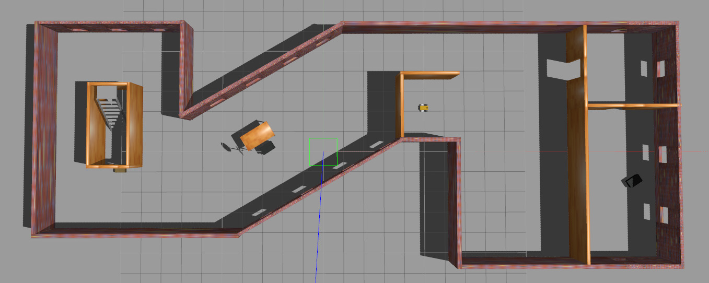
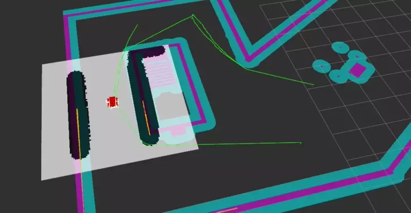

# RoboND Where Am I?


To run, execute:

```bash
roslaunch where_am_i world.launch
roslaunch where_am_i amcl.launch
```

You can also use keyboard teleop to control the bot manually:

```bash
rosrun teleop_twist_keyboard teleop_twist_keyboard.py
``` 

Building requires ROS Kinetic; you can try executing `./run_nvidia.sh` to drop into an X11 aware
Docker container with NVIDIA GPU support.

The simulation environment is this building:



Here's a visualization in RViz showing the individual planning elements:

- The global cost map is shown in false color, where pink corresponds to
  solid obstacles and cyan represents an "inflation zone" around it, used
  to provide a safety buffer defined by the bot's dimensions.
- The white rectangle represents the local map, in which white is safe space
  and black represents an obstacle.
- The orange lines are formed by a LiDAR point cloud as measured by the black
  sensor on top of the robot base, displayed here in red.
- The white arrows, lastly, represent particles of the Adaptive Monte-Carlo
  Localization ([AMCL](http://wiki.ros.org/amcl)) node.


After setting a navigation goal in RViz, we can observe the bot executing _some_
plan. As soon as the bot rotates, localization improves drastically:



On the other hand, here's a video of the bot being controlled via teleop through
the legs of the table in the left center of the map:


Note that in the current setup, the applied torque will result in the
bot doing a wheelie when accelerating, as well as a stoppie when braking.
This results in the LiDAR temporarily scanning the ceiling or the floor.
The cost maps are set up to ignore short-term interferences of this kind
and will recover from this behavior immediately, so it's not much of
an issue regarding the project.

## Issues

One of the biggest issues in control that's still unsolved is the disagreement
of the local planner with the global planner. In the following video,
the local costmap was never populated, resulting in the bot heading straight
for the wall.


Eventually, only removing both the `devel` and `build` directories, 
building from scratch and restarting the Docker container helped me there -
but still, the bot goes straight until the local cost map shows a clear obstacle. 

## Building with CLion IDE

**Note:** This does not _really_ work, as CLion will be unable to find generated headers. It's still a bit
          better than doing everything the hard way.

The full requirements for setting up CLion are given in the [sunsided/robond-ros-docker](https://github.com/sunsided/robond-ros-docker)
repository. In short, run SSHD in Docker, configure a Remote Host build to connect to it, then configure
the your build settings for ROS. For this repo and the included Dockerfile, this configuration will do:

**CMake options:**

```
-DCATKIN_DEVEL_PREFIX:PATH=/workspace/devel -DCMAKE_PREFIX_PATH=/workspace/devel;/opt/ros/kinetic;/opt/ros/kinetic/share
```

**Environment:**

```
ROS_ROOT=/opt/ros/kinetic/share/ros;ROS_PACKAGE_PATH=/workspace/src:/opt/ros/kinetic/share;ROS_MASTER_URI=http://localhost:11311;ROS_PYTHON_VERSION=2;ROS_VERSION=1;ROSLISP_PACKAGE_DIRECTORIES=/workspace/devel/share/common-lisp;ROS_DISTRO=kinetic;ROS_ETC_DIR=/opt/ros/kinetic/etc/ros;PYTHONPATH=/opt/ros/kinetic/lib/python2.7/dist-packages;PKG_CONFIG_PATH=/workspace/devel/lib/pkgconfig:/opt/ros/kinetic/lib/pkgconfig:/opt/ros/kinetic/lib/x86_64-linux-gnu/pkgconfig;LD_LIBRARY_PATH=/workspace/devel/lib:/opt/ros/kinetic/lib:/opt/ros/kinetic/lib/x86_64-linux-gnu:$LD_LIBRARY_PATH;PATH=/opt/ros/kinetic/bin:$PATH
```
